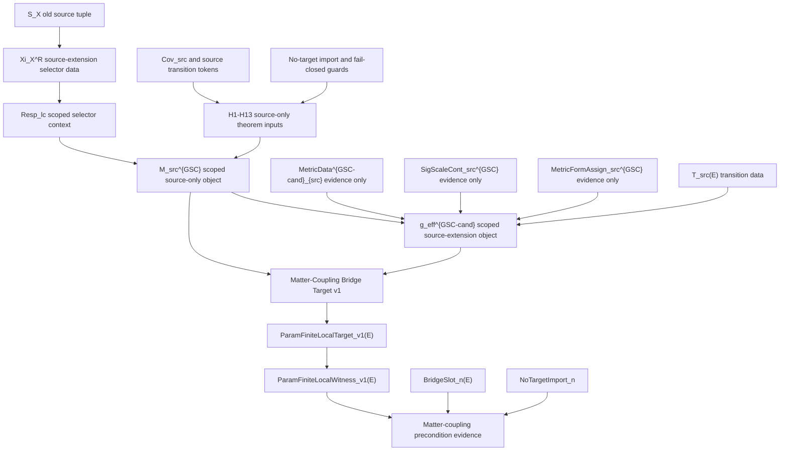

<!-- authority: control -->

# Source-Extension Dependency Extraction v1

## Control Status

This artifact is the P4-T01 dependency extraction for
`RT-20260629-043`. It is a `draft/control` source-extension dependency map.
It is not a compression result, source-law adoption, `MetricData(E)` adoption,
`g_eff` scope change, matter-coupling derivation, stress-energy semantics,
Einstein-equation derivation, benchmark promotion, Gate Chair verdict, or
completed-derivation claim.

The machine-readable dependency table is
`research_control/tasks/RT-20260629-043/artifacts/source_extension_dependency_table_v1.yaml`.

## Question

Extract the formal dependency graph of all source-extension data currently
used by `Resp_lc`, `M_src`, scoped `g_eff`, and matter-coupling precondition
evidence. Each dependency is classified using the P4-T01 categories:

- `derived_from_current_source_ontology`
- `conditional_theorem_input`
- `conservative_source_extension`
- `new_source_law_candidate`
- `new_ontology_primitive_candidate`
- `support_only_tooling_artifact`
- `forbidden_target_import_if_used_physically`
- `unknown_or_unclassified`

## Source Basis

The extraction reads the P2 frontier theorem inventory, the Distance-to-GR
ledger, the GR derivation burden map, and the key Gate Chair artifacts for
`Resp_lc`, `M_src`, scoped `g_eff`, and matter-coupling precondition evidence.
It also reads directly cited precursor artifacts for `M_src`, scoped `g_eff`,
and the parameterized finite/local source-family witness route.

The current frontier records `Resp_lc` as scoped source-extension selector
data, `M_src^{GSC}` as a scoped source-only object, `g_eff^{GSC-cand}` as a
scoped source-extension `g_eff` object, and `ParamFiniteLocalWitness_v1`,
`BridgeSlot_n`, and `NoTargetImport_n` as scoped source-extension
parameterized-witness evidence/precondition. These statuses are useful for
routing, but they are not physical completion statuses.

## Extraction Summary

The current stack contains four dependency bands.

1. `Resp_lc` uses `Xi_X^R` and `S_X^+` as explicit source-extension selector
   data. The old `S_X` route remains obstructed.
2. `M_src` uses a scoped source-only package under H1-H13, including
   `Cov_src^{GSC}`, source chart-support and transition tokens, conditional
   `RegSold_src^{GSC}` and `FVR_src^{GSC}`, no-target-import factorization,
   and `BottomSrc` fail-closed behavior.
3. Scoped `g_eff` uses the declared source package containing scoped
   `MetricData^{GSC-cand}_{src}` carrier evidence, `SigScaleCont_src^{GSC}`,
   `MetricFormAssign_src^{GSC}`, `T_src(E)`, bottom/no-target certificates,
   obstruction fallback labels, and limitation records.
4. Matter-coupling precondition evidence uses `Matter-Coupling Bridge Target
   v1`, `ParamFiniteLocalTarget_v1(E)`, `ParamFiniteLocalWitness_v1(E)`,
   `BridgeSlot_n(E)`, `NoTargetImport_n`, and finite/local source-family data.

No extracted dependency is classified as `derived_from_current_source_ontology`
without scoped source-extension or conditional-theorem qualification. No
current row is classified as a `new_source_law_candidate` or
`new_ontology_primitive_candidate` by P4-T01. That is not a rejection of those
possibilities. It means P4-T02 must first formalize what compression,
derivability, conservative extension, irreducibility, and target-import risk
mean for this stack.

## Dependency Categories

| Category | Count | Meaning in this packet |
| --- | ---: | --- |
| `derived_from_current_source_ontology` | 0 | No current dependency is extracted as source-ontology derivable without additional scoped or conditional status. |
| `conditional_theorem_input` | 8 | Inputs usable only inside stated theorem, guard, or fail-closed conditions. |
| `conservative_source_extension` | 11 | Scoped extension/evidence objects that are usable under declared source-side boundaries only. |
| `new_source_law_candidate` | 0 | P4-T01 does not nominate a source law. |
| `new_ontology_primitive_candidate` | 0 | P4-T01 does not nominate an ontology primitive. |
| `support_only_tooling_artifact` | 1 | Reproducibility/control support only, with `proof_authority=false`. |
| `forbidden_target_import_if_used_physically` | 2 | Negative guards: if needed as physical premises, the source-side route fails closed. |
| `unknown_or_unclassified` | 0 | No required dependency remains unclassified at this level of granularity. |

## Essential Sets

For scoped `g_eff`, the essential dependency set is:

- `M_src^{GSC}` scoped source-only context.
- H1-H13 source-only theorem inputs and fail-closed no-target discipline.
- `MetricData^{GSC-cand}_{src}` carrier evidence, with `no MetricData(E)`.
- `SigScaleCont_src^{GSC}` evidence/precondition.
- `MetricFormAssign_src^{GSC}` evidence/precondition.
- Declared `T_src(E)` transition data.
- `g_eff^{GSC-cand}(E;G^beta,T_src(E))` scoped source-extension object.
- Bottom, finite-scope, no-target, obstruction, and limitation records.

For matter-coupling precondition evidence, the essential dependency set is:

- `M_src^{GSC}` scoped source-only context.
- `g_eff^{GSC-cand}` scoped source-extension context.
- `Matter-Coupling Bridge Target v1`.
- Prior bridge-candidate evidence/precondition context.
- `ParamFiniteLocalTarget_v1(E)`.
- `ParamFiniteLocalWitness_v1(E)`.
- `BridgeSlot_n(E)`.
- `NoTargetImport_n`.
- Finite/local source-family witness data.

## Dependency Graph

## Claim Boundaries

This extraction preserves:

- `proposal-only` where earlier finite-variation or source-law-like inputs
  retain proposal status.
- `draft/control` for this packet and target/witness formalization artifacts.
- `source-extension` for scoped evidence and scoped objects.
- `fail-closed` for target import, bottom, and process-authority laundering.
- `frozen negative` only for the existing finite toy metric-response route,
  not as a global theory rejection.
- `no MetricData(E)` for the scoped metric carrier evidence.
- `no g_eff` as unscoped or canonical effective metric adoption.
- `proof_authority=false` for checkers, validators, registries, generated
  derivatives, roles, handoffs, approvals, local caches, file order, and
  commits.
- `no downstream GR promotion`.

## P4-T02 Consequence

The logical next step is not compression itself. The logical next step is P4-T02:
formalize the minimization target over this extracted table. P4-T02 should
define `SourceExtensionStack_v1`, `ExtensionDatum(E)`, `DerivableDatum(E)`,
`ConservativeExtension(E)`, `IrreduciblePrimitiveCandidate(E)`,
`TargetImportRisk(E)`, `CompressionMap_v1`, `MinimalSourceLawPackage_v1`,
`NoTargetImportPreservingCompression_v1`, and
`CompressionFailureObstruction_v1`.

Only after that target exists can a Candidate Constructor lawfully attempt
compression or name a precise obstruction.

## References

The AEther-Flow Research Project. (2026, June 17). *GR derivation burden map*
[Internal control note].

The AEther-Flow Research Project. (2026, June 18). *Resp_lc source-extension
human-gate adoption decision* [Internal research-control TeX artifact].

The AEther-Flow Research Project. (2026, June 24). *Gate Chair review of the
integrated source-only M_src adoption theorem candidate* [Internal
research-control TeX artifact].

The AEther-Flow Research Project. (2026, June 27). *Gate Chair review of
scoped g_eff adoption status* [Internal research-control TeX artifact].

The AEther-Flow Research Project. (2026, June 28). *Parameterized finite/local
source-family witness v1 source-extension evidence Gate Chair review*
[Internal research-control TeX artifact].

The AEther-Flow Research Project. (2026, June 29). *Frontier theorem
inventory* [Internal control design note].
