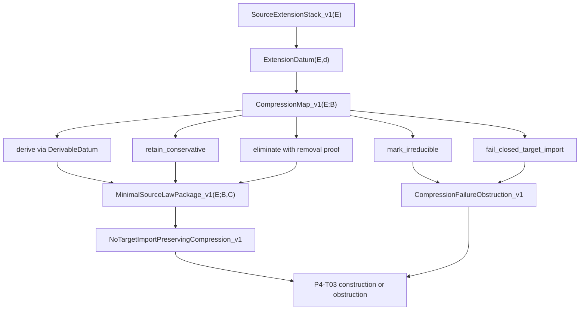

<!-- authority: control -->

# Source-Extension Minimization Target v1

## Control Status

This artifact is the P4-T02 target formalization for `RT-20260629-044`.
It is a `draft/control` source-extension minimization target. It defines what
later construction or obstruction must prove over the P4-T01 dependency stack.

It is not a compression result, source-law adoption, canonical ontology edit,
`MetricData(E)` adoption, `g_eff` scope change, matter-coupling derivation,
stress-energy semantics, Einstein-equation derivation, benchmark promotion,
Gate Chair verdict, or completed-derivation claim.

The machine-readable schema is
`research_control/tasks/RT-20260629-044/artifacts/source_extension_minimization_target_schema_v1.yaml`.

## Question

What would it mean to reduce the current source-extension stack to a smaller
source-side law package, while preserving no-target-import discipline and the
existing scoped statuses?

P4-T02 answers only by defining the target grammar. P4-T03 must perform the
construction-or-obstruction attempt.

## Source Basis

The target is defined over the P4-T01 dependency extraction and table:

- `research_control/tasks/RT-20260629-043/artifacts/source_extension_dependency_extraction_v1.md`
- `research_control/tasks/RT-20260629-043/artifacts/source_extension_dependency_table_v1.yaml`

The table contains 22 dependency rows. The essential set for scoped `g_eff`
uses `M_src^{GSC}`, H1-H13 theorem inputs, source chart/transition records,
fail-closed no-target guards, scoped `MetricData^{GSC-cand}_{src}`,
`SigScaleCont_src^{GSC}`, `MetricFormAssign_src^{GSC}`, `T_src(E)`, scoped
`g_eff^{GSC-cand}`, and bottom/limitation records. The essential set for
matter-coupling precondition evidence uses scoped `M_src^{GSC}`, scoped
`g_eff^{GSC-cand}`, `Matter-Coupling Bridge Target v1`,
`ParamFiniteLocalTarget_v1(E)`, `ParamFiniteLocalWitness_v1(E)`,
`BridgeSlot_n(E)`, `NoTargetImport_n`, and finite/local source-family data.

## Definitions

### SourceExtensionStack_v1

For a source situation `E`, `SourceExtensionStack_v1(E)` is the finite record
whose rows are the P4-T01 dependency rows. Each row records:

- a dependency id;
- a datum expression;
- a P4-T01 category;
- canonical source artifact paths;
- the objects that use the datum;
- whether it is essential for scoped `g_eff` or matter-coupling precondition
  evidence;
- the current scoped status;
- an overread guard.

This definition imports the dependency table as a control input. It does not
make the table an ontology source or proof authority.

### ExtensionDatum(E)

`ExtensionDatum(E,d)` holds when `d` is a row of
`SourceExtensionStack_v1(E)`. An extension datum may be a scoped
source-extension object, a conditional theorem input, a conservative
definition/evidence record, a support-only tooling artifact, or a forbidden
target-import guard.

`ExtensionDatum(E,d)` is a row-membership predicate. It is not adoption of the
datum as a source law or ontology primitive.

### DerivableDatum(E)

`DerivableDatum(E,d;B)` is a candidate property relative to a declared
source-side basis `B`. It means all of the following are shown by source-only
argument:

1. the datum behavior required by row `d` follows from `B`;
2. the derivation uses only canonical source artifacts and allowed
   draft/control source-side premises;
3. no target topology, target atlas, target metric, Lorentzian signature,
   proper time, detector semantics, stress-energy semantics, stress-energy
   tensor, matter action, Einstein equations, benchmark behavior, generated
   derivative, validator, registry metadata, handoff, approval, commit, or
   local cache is used as a mathematical premise;
4. the derivation preserves the current scoped status of `M_src`, scoped
   `g_eff`, and matter-coupling precondition evidence.

P4-T02 does not assert that any row is derivable. It defines what P4-T03 must
show if it assigns a row to `derive`.

### ConservativeExtension(E)

`ConservativeExtension(E,d;B)` is a candidate property. It means row `d` may
remain in the package as a scoped definitional or evidence record without
changing physical conclusions, adopting a new source law, changing ontology,
or expanding the scope of any earlier object.

A conservative extension can support a later local construction only inside
its declared source-extension boundary. It cannot by itself establish
`MetricData(E)`, unscoped `g_eff`, matter coupling, stress-energy semantics,
Einstein equations, benchmark recovery, or completed derivation.

### IrreduciblePrimitiveCandidate(E)

`IrreduciblePrimitiveCandidate(E,d;B)` is a failure-candidate status available
only after a later construction-or-obstruction packet attempts the target. It
requires evidence that row `d` cannot be derived, eliminated, or retained as a
conservative extension under basis `B` without target import.

This status is not adoption. It is not a canonical ontology primitive. It is
not a global no-go theorem. Its strongest P4-T03 meaning is:

`blocked_adoption_open_continuation`: current adoption is blocked while
same-milestone continuation remains open.

### TargetImportRisk(E)

`TargetImportRisk(E,d)` is the negative guard for row `d`. It holds when the
row, if used as a physical premise, would require any forbidden target or
process-authority surface:

- target topology, target atlas, target transition map, target metric, or
  Lorentzian signature;
- proper-time normalization, detector semantics, detector calibration, or
  empirical matter fields;
- stress-energy semantics, stress-energy tensor, matter action, Bianchi
  identity, Einstein equations, or benchmark fit;
- generated derivatives, validators, registries, role records, handoffs,
  approvals, commits, local caches, or file order as proof authority.

If `TargetImportRisk(E,d)` is unavoidable for a required physical conclusion,
the branch must be `fail-closed`.

### CompressionMap_v1

`CompressionMap_v1(E;B)` is a total assignment on the finite row set of
`SourceExtensionStack_v1(E)`. For each row `d`, it assigns exactly one status:

- `derive`: P4-T03 supplies a `DerivableDatum(E,d;B)` argument.
- `retain_conservative`: P4-T03 supplies a `ConservativeExtension(E,d;B)`
  argument.
- `eliminate`: P4-T03 proves the later target does not use row `d` and that
  removal does not change any scoped output or guard.
- `mark_irreducible`: P4-T03 supplies an
  `IrreduciblePrimitiveCandidate(E,d;B)` record.
- `fail_closed_target_import`: P4-T03 shows `TargetImportRisk(E,d)` is
  unavoidable for the attempted target.

The map must cover every row. It must not collapse notation into mathematics:
renaming, deleting labels, or ignoring a table entry is not elimination unless
the required behavior is proven unnecessary.

### MinimalSourceLawPackage_v1

`MinimalSourceLawPackage_v1(E;B,C)` is a candidate package consisting of a
declared basis `B` and compression map `C = CompressionMap_v1(E;B)`.

It satisfies the target only if a later packet proves:

1. `C` covers every row in `SourceExtensionStack_v1(E)`;
2. all rows essential for scoped `g_eff` and matter-coupling precondition
   evidence are derived, retained conservatively, explicitly marked
   irreducible, or failed closed with a scoped obstruction;
3. no assignment uses target imports or `proof_authority=false` process
   surfaces;
4. no assignment expands existing statuses: no `MetricData(E)`, no unscoped
   `g_eff`, no matter coupling, no stress-energy semantics, no Einstein
   equations, and no benchmark promotion;
5. deletion minimality is witnessed by a finite deletion test or proof sketch:
   removing any retained row either changes a required scoped target, breaks a
   guard, or produces a named obstruction.

P4-T02 does not assert that a minimal package exists.

### NoTargetImportPreservingCompression_v1

`NoTargetImportPreservingCompression_v1(E;B,C)` holds only if every assignment
in `C` satisfies source-purity constraints. In particular, the following
surfaces have `proof_authority=false`: generated derivatives, validators,
registries, role records, handoffs, approvals, commits, local caches, and file
order.

This property is a required condition for any future compression candidate.

### CompressionFailureObstruction_v1

`CompressionFailureObstruction_v1(E,d;B,O)` is a scoped failure record. It
contains:

- the row id `d`;
- the declared basis `B`;
- the failed obligation `O`;
- the attempted assignment status;
- the evidence path;
- the exact conclusion blocked;
- the same-milestone continuation status.

Allowed obstruction wording:

"Row `d` cannot be compressed under current basis `B` and obligation `O`
without target import or an unproven source-side primitive."

Forbidden overread:

"Therefore all source-extension research is impossible."

## Target Diagram

## Allowed Conclusions

P4-T02 allows only these conclusions:

- the minimization target is formally specified;
- P4-T03 has a precise construction-or-obstruction target;
- future compression must preserve no-target-import, no-process-authority,
  and existing scoped-status constraints;
- future failure must be datum-scoped and basis-scoped.

## Non-Allowed Conclusions

P4-T02 does not allow:

- compression success;
- compression failure or obstruction;
- source-law adoption;
- canonical ontology edit;
- adoption of an irreducible primitive;
- `MetricData(E)` adoption;
- `g_eff` scope change or unscoped `g_eff`;
- coupling-law adoption;
- matter-coupling derivation or adoption;
- stress-energy semantics, stress-energy tensor, matter action, or detector
  semantics;
- Einstein equations;
- benchmark promotion or Gate Chair closure;
- completed derivation;
- global source-extension impossibility;
- global theory rejection.

## P4-T03 Handoff

The logical next packet is P4-T03. It should use
`candidate-constructor@0.2.0` and end with exactly one of:

- `constructed_candidate`
- `precise_obstruction`
- `minimal_countermodel`
- `human_gate_required`
- `route_frozen_recommended`

P4-T03 must cite this target and either construct a
`MinimalSourceLawPackage_v1` or produce a precise
`CompressionFailureObstruction_v1`.

## Claim Boundaries

This target preserves:

- `proposal-only` for earlier proposal-only inputs;
- `draft/control` for this packet and future target/candidate artifacts;
- `source-extension` for scoped evidence and objects;
- `fail-closed` for target import and process-authority laundering;
- `frozen negative` only where already recorded, not as a new global result;
- `no MetricData(E)`;
- `no g_eff` as unscoped or canonical effective metric adoption;
- `proof_authority=false`;
- `no downstream GR promotion`.

## References

The AEther-Flow Research Project. (2026, June 17). *GR derivation burden map*
[Internal control note].

The AEther-Flow Research Project. (2026, June 29). *Recommendations
implementation plan continue task v12* [Internal implementation plan].

The AEther-Flow Research Project. (2026, June 29). *Source-extension
dependency extraction v1* [Internal research-control Markdown artifact].
